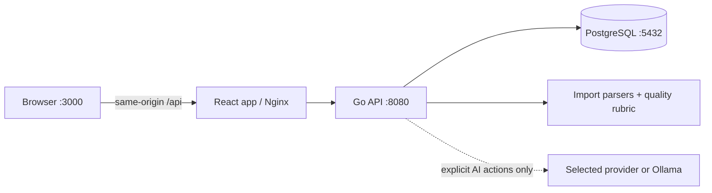

<div align="center">

# FORMA

### Smart Resume Builder

**Build, score, refine and export a professional resume that stays yours.**

FORMA is a local-first, self-hosted resume workspace with structured editing,
live preview, a stable 100-point quality rubric and optional AI assistance.

[](#project-status)
[](LICENSE)


[**Quick start**](#quick-start) &middot; [Features](#what-forma-does) &middot;
[Documentation](docs/README.md) &middot; [Contributing](docs/CONTRIBUTING.md)

<sub>No account &middot; No subscription &middot; No telemetry &middot; AI optional</sub>

</div>

---

> [!IMPORTANT]
> **Your resume is local by default.** FORMA stores it in your PostgreSQL
> volume and contacts no model while you type, import, preview or export.
> Content leaves the machine only when you explicitly run an AI action with a
> provider you configured.

## What FORMA does

<table>
<tr>
<td width="33%" valign="top">
<h3>Build</h3>
Edit contacts, summary, experience, projects, education, skills and optional
sections beside a live resume preview. Choose from multiple ATS-conscious
layouts and add a profile photo only when it makes sense.
</td>
<td width="33%" valign="top">
<h3>Review</h3>
Use the same versioned 100-point rubric on every run. Deterministic checks work
without an API key; optional AI adds evidence-based semantic feedback and
targeted rewrites.
</td>
<td width="33%" valign="top">
<h3>Export</h3>
Download a selectable-text PDF, an editable DOCX for Word or Google Docs, or a
portable FORMA JSON backup. Suggestions never alter the resume until you
approve them.
</td>
</tr>
</table>

| At a glance | Current support |
| --- | --- |
| **Run it** | Docker Compose on your own machine |
| **Stack** | React + Vite, Go, PostgreSQL |
| **Import** | FORMA JSON, JSON Resume, DOCX, text-layer PDF, LinkedIn export ZIP |
| **Export** | Selectable-text PDF, editable DOCX, FORMA JSON |
| **AI** | Optional hosted providers, custom compatible APIs or local Ollama |
| **Best fit today** | Trusted, local, single-user resume building |

## Quick start

You need Docker Desktop with Compose v2, or Docker Engine with the Docker
Compose plugin.

**macOS, Linux or Git Bash**

```bash
cp .env.example .env
docker compose up --build -d
```

**Windows PowerShell**

```powershell
Copy-Item .env.example .env
docker compose up --build -d
```

Open **[localhost:3000](http://localhost:3000)** and start editing.

```bash
# Inspect the running services
docker compose ps

# Follow application logs
docker compose logs --follow api web

# Stop FORMA without deleting resume data
docker compose down
```

Only the web service is published to the host. It reaches the Go API through
the same-origin `/api` proxy, while PostgreSQL stays inside the Compose network.
Resume data survives `docker compose down` in a named volume.

> [!CAUTION]
> `docker compose down --volumes` permanently deletes the local database.

## Project status

FORMA is a **working open-source project provided as-is**. The current local
workflow is usable today, but there is no promised roadmap, release cadence,
support window or continued-maintenance commitment. Issues and focused pull
requests are welcome; opening one does not create an obligation to implement,
review or merge it.

Fork it, adapt it and make it better. If development continues, APIs, migrations
and saved-document shapes may change. FORMA is not a production-hardened
multi-user service.

### Available today

- Structured editor, live preview, optional profile photo and multiple layouts.
- Preview-before-apply imports with no AI call during parsing.
- A versioned resume rubric and actionable checklist without an API key.
- Explicit AI review and rewrite flows across popular providers.
- Selectable-text PDF, editable DOCX and portable JSON exports.
- PostgreSQL persistence and a one-command Docker Compose setup.

<details>
<summary><strong>Known limitations</strong></summary>

- FORMA assumes a trusted local machine. It has no user accounts, access-control
  layer or supported public multi-tenant deployment.
- PDF and DOCX imports use conservative heuristics. Scanned PDFs are not
  supported; always verify imported dates, employers and claims.
- DOCX export preserves clean, editable, ATS-friendly content and hierarchy,
  but approximates browser-only template styling rather than promising a
  pixel-identical Word document.
- A LinkedIn URL can be stored as a contact link, but FORMA does not fetch or
  scrape it. Import an official data-export ZIP or a text-based LinkedIn PDF.
- AI output can be wrong and cannot guarantee hiring outcomes, factual accuracy
  or compatibility with every applicant-tracking system.
- Backward compatibility and future releases are not guaranteed.

</details>

## Import an existing resume

Open **Import** in the editor and select a supported file. FORMA parses it in
memory and shows a preview before anything is merged or replaced. Importing
never calls an AI provider.

| Input | Notes |
| --- | --- |
| FORMA JSON | Restores a portable FORMA backup |
| JSON Resume | Maps the standard schema into editable sections |
| DOCX | Extracts text and reconstructs supported resume fields |
| PDF | Requires a selectable text layer; scanned documents are unsupported |
| LinkedIn export ZIP | Reads allowlisted profile, positions, education, skills, projects, certifications and languages CSVs |

See [Importing](docs/IMPORTING.md) for mappings, limits and LinkedIn export
instructions.

## A score the model cannot improvise

The Go API owns the rubric and its weights. A model cannot invent a different
scale because it woke up feeling philosophical that morning.

| Rubric layer | Points | API key | What it measures |
| --- | ---: | :---: | --- |
| Deterministic checks | **60** | Not required | Completeness, structure, evidence signals, clarity mechanics and consistency |
| Semantic assessment | **40** | Optional | Impact strength, specificity, target relevance and professional clarity |
| **Total** | **100** | &mdash; | One versioned scoring contract and one actionable checklist |

Without AI, FORMA still runs every deterministic rule and identifies semantic
points it cannot honestly assess. With AI configured, the provider returns
evidence for four fixed semantic criteria; the API validates that evidence
before adding it to the score.

Read [Resume rubric](docs/RESUME_RUBRIC.md) for exact weights, readiness gates
and scoring behavior.

## Optional AI

Open **AI settings**, select a provider, enter an editable model ID and add an
API key for that browser session. Keys do not belong in `.env`: the API keeps
them only in TTL-limited process memory associated with an HttpOnly, SameSite
session cookie.

Supported integrations include OpenAI, Anthropic Claude, Google Gemini,
DeepSeek, Alibaba Qwen, Moonshot Kimi, Z.AI/GLM, custom OpenAI-compatible APIs
and local Ollama.

<details>
<summary><strong>Provider and protocol matrix</strong></summary>

| Provider option | Protocol | Endpoint configuration |
| --- | --- | --- |
| OpenAI | Responses API with native schema | Managed preset; optional compatible base URL |
| Anthropic Claude | Messages API with tool schema | Managed preset |
| Google Gemini | `generateContent` with native schema | Managed preset |
| DeepSeek | OpenAI-compatible Chat Completions | Managed preset or custom base URL |
| Alibaba Qwen | OpenAI-compatible Chat Completions | Region-aware custom base URL supported |
| Moonshot Kimi | OpenAI-compatible Chat Completions | Managed preset or custom base URL |
| Z.AI / GLM | OpenAI-compatible Chat Completions | Managed preset or custom base URL |
| Custom compatible API | OpenAI-compatible Chat Completions | Base URL required |
| Ollama | Local `/api/chat` | Local base URL; API key optional |

Model catalogs change quickly, so model IDs remain editable instead of being
hard-coded into a short-lived list.

</details>

### AI boundaries

- Only explicit **Review** and **Rewrite** actions contact the selected model.
- The API removes the person's name and contact fields before sending a resume.
- A target role or job description is included only when supplied for that
  action.
- Prompts prohibit invented facts and responses are validated locally.
- Suggestions remain proposals until the user explicitly applies them.

A hosted provider still receives the sanitized content required for the action
and handles it under its own terms. Local Ollama can keep inference on the
operator's machine. See [Privacy](docs/PRIVACY.md) for the exact data flow.

## Architecture



Database migrations are embedded in the API and applied at startup. Provider
adapters share one normalized review/rewrite contract; credentials remain
ephemeral. See [Architecture](docs/ARCHITECTURE.md) for service boundaries and
extension points.

## Contributing

FORMA welcomes focused pull requests, bug reports, documentation,
accessibility improvements, resume templates and provider adapters. There is no
guaranteed response time or merge schedule, and forks are always welcome.

1. Read [Contributing](docs/CONTRIBUTING.md) and the
   [Code of Conduct](docs/CODE_OF_CONDUCT.md).
2. Use the repository's short issue or pull-request template.
3. Keep examples synthetic and never attach a real resume or API key.
4. Report security issues through the private guidance in
   [Security](docs/SECURITY.md).

The complete project documentation lives in [docs](docs/README.md).

<details>
<summary><strong>Development checks</strong></summary>

Use the Go version declared in `apps/api/go.mod` and a current Node.js LTS
release with npm:

```bash
npm --prefix apps/web ci
npm --prefix apps/web run test
npm --prefix apps/web run build
npm --prefix apps/web run test:sites

cd apps/api
go vet ./...
go test ./...
go build -o ../../bin/forma-api ./cmd/api
```

If GNU Make is available, `make help` lists local shortcuts. GitHub Actions also
checks Go formatting, frontend and backend tests, production builds, Compose
configuration and container images.

</details>

## Say thank you

<div align="center">

FORMA is free and open source.

If it helped you build a better resume or avoid another subscription, you can
support the project here:

### [Say thank you on Ko-fi](https://ko-fi.com/mikhailbovt)

<sub>Donations do not unlock features or purchase development commitments.</sub>

</div>

## License

Copyright 2026 Mikhail Bovt.

FORMA is licensed under the [Apache License 2.0](LICENSE). The bundled DejaVu
font files used for Cyrillic PDF export retain their
[upstream font license](apps/web/public/licenses/dejavu-fonts.txt).
