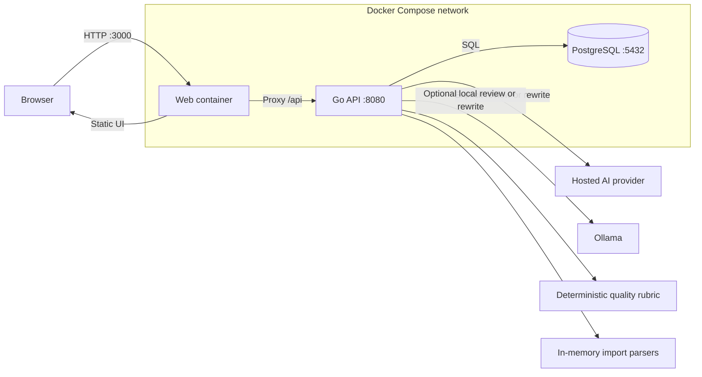
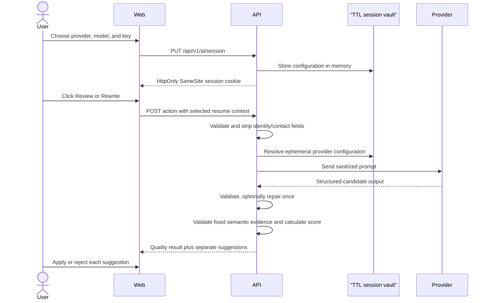

# Forma architecture

This document describes Forma's current local deployment boundaries and the
constraints new features must preserve. It is intentionally implementation-led:
privacy promises here should remain testable in code.

## Design goals

1. Keep resume authoring fast, understandable, and local by default.
2. Make every external AI transfer an explicit user action.
3. Support several provider protocols behind one validated domain contract.
4. Publish only one browser-facing port in the default deployment.
5. Prefer replaceable, small components over provider-specific behavior in the
   editor.

## Runtime topology



Only the web container publishes a host port. The API and database are
discoverable by service name inside the Compose bridge network. This prevents
accidental direct host exposure; it is not a substitute for host firewalling or
container security. The API also receives a `host.docker.internal` host-gateway
mapping so a user can deliberately select an Ollama service running on the
Docker host.

| Component | Responsibility | Persistent state |
| --- | --- | --- |
| `apps/web` | Editor, section navigation, preview, provider dialog, review decisions | None required by the container |
| `apps/api` | Resume API, validation, import preview, quality rubric, migrations, AI-session vault, provider adapters | Resume records through PostgreSQL; provider keys only in memory |
| `postgres` | Structured resume storage | Named Docker volume `postgres_data` |
| AI provider | Review or rewrite inference | Outside Forma's control; provider policy applies |

## Request routing and health

Browser requests use same-origin `/api` URLs. The web runtime forwards those
requests to `http://api:8080`; the API is not mapped to a host port. The default
health contracts are:

- API HTTP health: `GET /api/v1/health`
- API container health: `/forma-api healthcheck`
- Web health: `GET /health`
- PostgreSQL health: `pg_isready`

Compose starts PostgreSQL first, waits for it to become healthy, starts the API
and its embedded migrations, then waits for the API before starting the web
service.

## Resume data

The browser edits a structured resume rather than an opaque document. The
domain model can evolve, but it should retain explicit fields for identity and
contact details, profile/summary, work experience, projects or portfolio,
education, skills, and optional supporting sections. Presentation templates
consume that normalized structure and must not mutate source facts.

Schema migrations are embedded in the Go binary and run during API startup.
Migration changes must be forward-safe, reviewed with their model changes, and
covered by tests. Destructive or lossy migrations require an explicit backup
and recovery note in the pull request.

## Import boundary

`POST /api/v1/imports/preview` accepts a single user-supplied file and returns a
normalized candidate, parser provenance, field mappings, and warnings. It does
not save the upload or the candidate. Forma supports its own JSON shape, JSON
Resume, DOCX, text-layer PDF, and allowlisted CSVs from an official LinkedIn
data-export ZIP.

Parsing is deterministic and in memory. File bytes, extracted text, ZIP entry
count, expanded bytes, and compression ratio are bounded. Archive paths are
normalized and allowlisted. The import path never calls an AI provider and
never performs outbound HTTP requests. In particular, Forma does not fetch or
scrape LinkedIn profile URLs; the browser can retain a validated URL as a
profile link while the user uploads their own export.

The browser shows the preview before offering two explicit operations:

- **Merge safely** fills empty scalar fields and appends unique entries without
  overwriting existing facts.
- **Replace content** replaces content while preserving local presentation
  choices such as template and paper size.

Only the normal resume save route persists the result after the user applies
one of those operations.

## Quality rubric

`POST /api/v1/quality/evaluate` runs without an AI session. Rubric version
`forma-quality/1.0.0` allocates up to 60 points to applicable deterministic
rules and returns rule-level evidence, blockers, ATS-hygiene signals, and 40
explicitly unassessed semantic points. The API returns both raw earned and
assessed points plus a deterministic `normalized_score`. The UI uses that
normalized value on a stable `/100` scale and displays assessment coverage
separately, so optional or non-applicable checks are never hidden.

An explicit AI review may assess the remaining 40 points, but the provider does
not choose categories, weights, or a final score. It must return one assessment
for each fixed semantic rule. The Go API rejects unknown or duplicate rule IDs,
low-confidence verdicts, and evidence that is not an exact quote from the
sanitized resume. Target relevance remains unassessed unless the user provided
a target role or job description. Editorial suggestions remain separate from
the rubric and require explicit application.

## AI session and provider abstraction

The API exposes a short-lived AI configuration session:

```text
PUT /api/v1/ai/session
{ provider, model, api_key, base_url? }
```

The API stores this configuration in process memory for `AI_SESSION_TTL` and
returns an opaque session cookie configured as HttpOnly and SameSite. The key is
not returned to the browser, written to PostgreSQL, or included in later review
bodies. Restarting the API invalidates all AI sessions.

Provider adapters normalize two operations:

- **Review:** return bounded, structured findings and suggestions.
- **Rewrite:** propose a replacement for selected source text while preserving
  supplied facts.

Native adapters use provider-supported schemas where practical. OpenAI-
compatible adapters request JSON, validate it locally, and permit one bounded
repair retry. Ollama uses its local chat JSON mode. Model identifiers remain
editable because provider catalogs and aliases change independently of Forma.

Adding an adapter should require provider translation code and contract tests,
not editor changes. A new adapter must document authentication, endpoint
selection, timeout behavior, schema guarantees, error redaction, and whether it
can remain fully local.

## Explicit AI request flow



Typing, autosaving, template selection, preview, and export must not enter this
flow.

## Privacy and security invariants

- Provider secrets never enter source control, `.env`, PostgreSQL, response
  bodies, application logs, or error messages.
- The API recursively removes the resume owner's name and contact fields before
  provider dispatch.
- A job description and target role are sent only if present in the requested
  action.
- AI responses are untrusted: enforce body limits, decode into bounded types,
  validate schemas, and render as text rather than executable markup.
- Model output cannot supply score weights or a final score; only validated
  evidence for the fixed semantic rubric may affect the result.
- Import parsing performs no network access, writes no temporary upload, and
  persists nothing before an explicit apply-and-save action.
- Requests use timeouts and bounded retries. Never retry authentication or
  validation failures indefinitely.
- Database and API ports remain internal in the default Compose deployment.
- Production deployments behind HTTPS must set secure-cookie behavior and an
  exact allowed origin; permissive wildcard origins are not acceptable with
  credentials.

See [PRIVACY.md](PRIVACY.md) for the user-facing data inventory and deletion
procedure.

## Configuration

| Variable | Component | Purpose |
| --- | --- | --- |
| `WEB_PORT` | Compose | Host port mapped to the web container |
| `POSTGRES_DB`, `POSTGRES_USER`, `POSTGRES_PASSWORD` | Compose/PostgreSQL | Local database and connection credentials |
| `HTTP_ADDR` | API | Listen address inside its container |
| `DATABASE_URL` | API | PostgreSQL connection string |
| `CORS_ORIGIN` | API | Exact browser origin allowed for direct development calls |
| `AI_SESSION_TTL` | API | Lifetime of an in-memory provider session |
| `COOKIE_SECURE` | API | Require HTTPS when sending the AI-session cookie |
| `MAX_BODY_BYTES` | API | Maximum accepted non-import request-body size; import preview has a fixed 16 MiB multipart envelope |
| `API_UPSTREAM` | Web | Internal API origin used by the `/api` proxy |

Provider keys are runtime user input, not environment configuration.

## Failure and recovery model

- An unhealthy or unavailable database keeps the API from becoming ready.
- A failed startup migration prevents the API from serving requests.
- Provider failures return a bounded application error; saved resume content
  remains usable and editable.
- API restart clears provider sessions but does not delete resume records.
- `docker compose down` keeps the named database volume.
- `docker compose down --volumes` permanently deletes Compose-managed resume
  data and is intentionally documented as destructive.

## Repository layout

```text
apps/api/             Go API, migrations, and provider adapters
apps/web/             Web editor and same-origin API proxy
docs/                 Architecture, privacy, and release imagery
.github/workflows/    Continuous integration
compose.yaml          Local production-shaped stack
```

Changes that alter a boundary, persistent data, credential handling, or an
external transfer should update this document in the same pull request.
